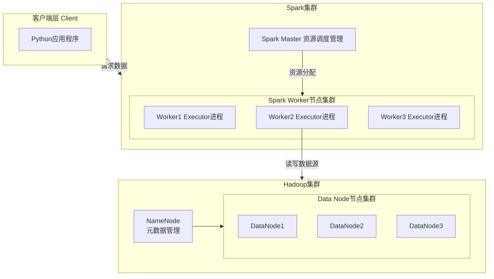

# Spark 大数据可视化


## 集群结构



## 安装 Spark 集群

### 获取镜像

```sh
docker pull spark:python3
```

### QuickStart

```sh
docker run -it --rm spark:python3 /opt/spark/bin/pyspark
```

### 集群

```yml
version: '3.8'
services:
  spark-master:
    image: spark:python3
    container_name: spark-master
    ports:
      - "8080:8080"   # Spark Master Web UI
      - "7077:7077"   # Spark Master 通信端口
    environment:
      - SPARK_MASTER_HOST=spark-master
    command: >
      bash -c "
      /opt/spark/sbin/start-master.sh &&
      tail -f /dev/null
      "
    networks:
      - spark-network

  spark-worker:
    image: spark:python3
    container_name: spark-worker
    depends_on:
      - spark-master
    ports:
      - "8081:8081"   # Spark Worker Web UI
    environment:
      - SPARK_MASTER_URL=spark://spark-master:7077
    command: >
      bash -c "
      /opt/spark/sbin/start-worker.sh spark://spark-master:7077 &&
      tail -f /dev/null
      "
    networks:
      - spark-network

networks:
  spark-network:
    driver: bridge
```

### pyspark

```python
from pyspark.sql import SparkSession

spark = (SparkSession.builder
         .appName("PySpark Tutorial")
         .master("spark://spark-master:7077")
         .getOrCreate())

df = spark.read.csv('hdfs://myhadoop:9000/user/root/online_retail.csv',header=True,escape="\"")

df.show(5,0)
```

## 安装 Hadoop 伪分布式模式


## 安装 Python Client 


### 

```
```


### 设置 pip 国内镜像

```sh
pip config set global.index-url https://mirrors.tuna.tsinghua.edu.cn/pypi/web/simple
```

### 获取镜像

```sh
docker pull python:3.10
```

### 安装 pyspark

```sh
pip install pyspark
```

### 安装 Java 17+


## Flask Hello World


Flask 是一个用 Python 编写的轻量级 Web 框架

它适合用来快速开发小型项目、API 服务，或者作为学习 Web 开发的入门框架

### 安装 flask

```sh
pip install flask
```


```python
from flask import Flask

# 创建 Flask 实例，__name__ 参数帮助框架定位资源文件
app = Flask(__name__)

# 使用 route() 装饰器告诉 Flask 哪个 URL 会触发这个函数
@app.route('/')
def hello_world():
    # 视图函数，返回需要在浏览器中显示的内容
    return '<p>Hello, World!</p>'

if __name__ == '__main__':
    # 运行开发服务器，开启调试模式（代码变动时自动重启）
    app.run(port=5000, debug=True)
```

### 模板渲染 (Jinja2)

对于需要返回复杂HTML页面的场景，可以使用模板引擎

```python
from flask import Flask, render_template

@app.route("/")
def home():
    return render_template("index.html")

```

## Hello Echarts

### app.py

```python
from flask import Flask, jsonify, render_template
import random

app = Flask(__name__)

@app.route("/")
def home():
    return render_template("index.html")

@app.route("/api/data")
def get_data():
    # 生成 12 个月
    months = [f"{i}月" for i in range(1, 13)]
    amounts = [random.randint(2000, 6000) for _ in range(12)]
    return jsonify({"labels": months, "values": amounts})


if __name__ == '__main__':
    app.run(port=5000, debug=True)
```

### templates/index.html

```html
<!DOCTYPE html>
<html>
<head>
    <meta charset="utf-8">
    <script src="https://cdn.jsdelivr.net/npm/echarts/dist/echarts.min.js"></script>
    <script src="https://cdn.jsdelivr.net/npm/axios/dist/axios.min.js"></script>
</head>
<body>
<div id="main" style="width:700px;height:450px;"></div>
<script>
let myChart = echarts.init(document.getElementById('main'));

axios.get("/api/data").then(res=>{
    let option = {
        title:{text:"Spark在线计算-ECharts展示"},
        xAxis:{data:res.data.labels},
        yAxis:{},
        series:[{type:"bar",data: res.data.values}]
    }
    myChart.setOption(option);
})
</script>
</body>
</html>
```